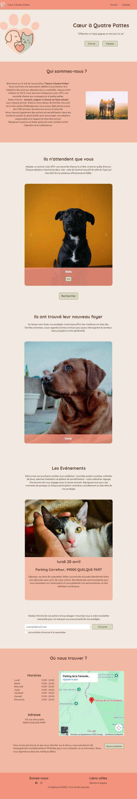
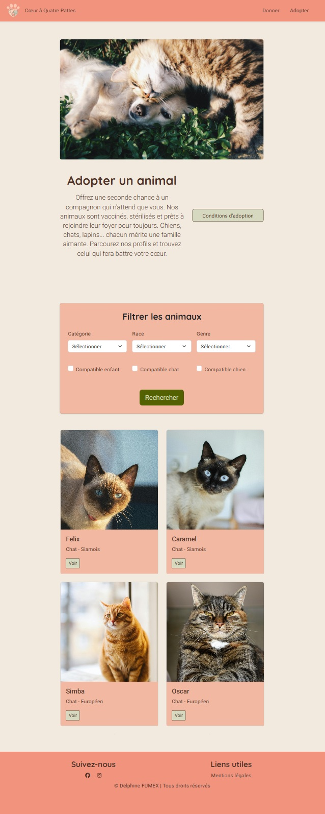

# Coeur à Quatre Pattes

## 1. Description du projet

Coeur à Quatre Pattes est une application web développée avec Symfony permettant la gestion des animaux et des événements d'une association d’adoption.

---

## 2. Technologies utilisées

### **Front-End**

- HTML5
- CSS3 & Sass
- Bootstrap
- JavaScript (Vanilla)
- Approche mobile-first

### **Back-End**

#### Langage & Framework

- PHP 8
- Symfony 8

#### Gestion des données

- Doctrine ORM
- Doctrine Migrations

#### Sécurité

- Symfony Security
- SymfonyCasts Reset Password Bundle
- Protection CSRF

#### Templates & formulaires

- Twig
- Symfony Form
- Symfony Validator

#### Services supplémentaires

- Symfony Mailer
- PhpSpreadsheet (export Excel)

### **Base de données**

- **MySQL** : Relations entre utilisateurs, animaux et événements
- **MongoDB** : Stockage des inscriptions à la newsletter

---

## 3. Environnement de travail

- IDE : VS Code avec extensions PHP Intelephense, Prettier, ESLint.
- Serveur local : Docker.
- Versionning : Git & GitHub.

---

## 4. Sécurité

- Authentification via Symfony Security
- Gestion des rôles (Visiteur, Employé, Administrateur)
- Hashage automatique des mots de passe via le composant Security
- Système sécurisé de réinitialisation de mot de passe (SymfonyCasts Reset Password)
- Protection CSRF sur les formulaires
- Validation des données avec Symfony Validator

---

## 5. Fonctionnalités principales

### Visiteur

- Consulter la page d'accueil
- Rechercher et filtrer les animaux disponibles à l’adoption
- Consulter la fiche détaillée d’un animal
- S’inscrire à la newsletter

### Employé

- Créer et modifier les fiches des animaux
- Gérer les événements organisés par l'association

### Administrateur

- Gérer les utilisateurs
- Gérer les emails inscrits à la newsletter

---

## 6. Aperçu de l'application

### Page d’accueil



### Page de recherche d'animaux



## 7. Installation

### 1. Cloner le dépôt :

```bash
 git clone https://github.com/Delphine2004/association.git
 cd association
```

### 2. Copier le fichier d’exemple des variables d’environnement :

```bash
cp .env.example .env
```

Modifier les mots de passe dans le fichier .env si nécessaire.

### 3. Construire et lancer les conteneurs :

```bash
docker compose up -d --build
```

L’application accessible : http://localhost:8000

MailHog accessible : http://localhost:8025

(Adapter les ports en fonction du fichier .env. si modifiés)

### 4. Créer la base de donnée :

Rentrer dans le conteneur php

```bash
docker compose exec php bash
```

Exécuter les migrations

```bash
php bin/console doctrine:migrations:migrate
```

### 5. Générer les données :

Toujours dans le conteneur php

```bash
php bin/console doctrine:fixtures:load
```

### Comptes de test

Après exécution des fixtures, les comptes suivants sont disponibles :

- Administrateur  
  Email : admin@association.fr  
  Mot de passe : `admin123\*`

- Employé  
  Email : staff@association.fr  
  Mot de passe : `staff123\*`

---

## 8. Auteur

Projet développé par Delphine FUMEX

- GitHub : https://github.com/Delphine2004
- LinkedIn : https://www.linkedin.com/in/delphine-fumex/
